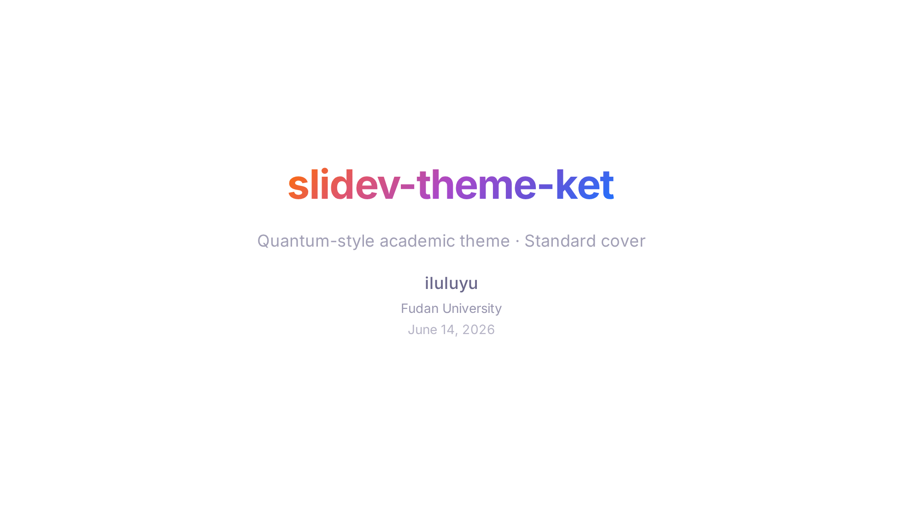
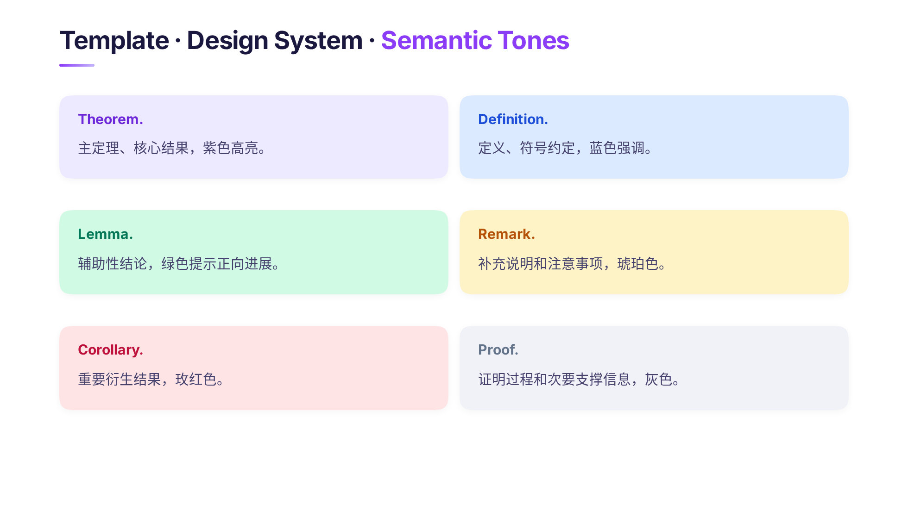

# slidev-theme-ket

[](https://www.npmjs.com/package/slidev-theme-ket)

An academic theme for [Slidev](https://sli.dev) — built for talks with theorems,
definitions, and math.



## Highlights

- `Bra` theorem / definition / note blocks with semantic tones
- Four cover variants: `cover`, `cover-deco`, centered `PaperCover`, deco `PaperCover`
- `Figure` component for referenced images with Markdown captions
- Layouts for every talk beat: cover, section, two-column, thanks
- Quantum dot-grid background that recolors in dark mode
- Geist typography, self-hosted (no runtime font requests)

## Preview locally

```bash
pnpm install
pnpm dev      # → http://localhost:3030
```

`pnpm build` renders the showcase; `pnpm screenshot` captures the first slide.

## Use in a deck

```yaml
---
theme: ket
---
```

For local development, point at this directory:

```yaml
---
theme: ../../slidev-theme-ket
---
```

## Design system

Ket pairs a quantum dot-grid ground with deep indigo text and a single violet
accent. Semantic color appears only when it carries meaning — each `Bra` tone
maps to a role.



| Token | Value | Role |
| --- | --- | --- |
| `--ket-ac` | `#7229E8` | Violet accent |
| `--ket-t1` | `#1B1840` | Primary text |
| `--ket-t2` | `#46426E` | Body text |
| `--ket-t3` | `#8E8BAD` | Captions |

Full token tables, dot-grid tuning, and global chrome: [docs/design-tokens.md](./docs/design-tokens.md).

## Components

### `Bra`

Academic theorem and note block.

```vue
<Bra type="theorem" name="No-Cloning" :number="1">

There is no unitary $U$ that clones every state $|\psi\rangle$.

</Bra>
```

Common props:

- `type`: `theorem`, `lemma`, `proof`, `definition`, `corollary`, `question`, `assumption`, `protocol`
- `title`, `name`, `number`
- `tone`: `default`, `primary`, `success`, `warning`, `danger`, `muted`
- `compact`, `border`, `italic`
- `color`, `bg-color`, `title-color`, `border-color`

### `PaperCover`

Academic paper cover — title, authors, affiliations, optional decoration.

```vue
<PaperCover
  deco
  title="Exponential Speedup in Measurement Property Learning"
  :authors="[['Z. Liu', '1'], ['Q. Ye', '1,2']]"
  :affiliations="[['1', 'Tsinghua University'], ['2', 'Shanghai Qi Zhi']]"
/>
```

### `Figure`

Referenced image with a figure number and Markdown caption.

```vue
<Figure src="/figures/bloch-sphere.svg" :number="1" width="70%">

**Bloch sphere** — pure states $|\psi\rangle$ lie on the unit sphere.

</Figure>
```

Full props, the `type → tone` map, and compatibility notes: [docs/components.md](./docs/components.md).

## Layouts

| Layout | Purpose |
| --- | --- |
| `cover` | Centered title with presenter metadata |
| `cover-deco` | Left-aligned title with orbit / custom decoration |
| `intro` | Quiet centered interlude |
| `section` | Numbered section divider with tags |
| `default` | Standard content slide |
| `two-cols-header` | Full-width heading above two adjustable columns |
| `thanks` | Closing slide |

Useful frontmatter:

- `gradient: true` — gradient title fill
- `tag` — eyebrow label on `cover-deco`
- `sectionNumber` / `tags` — on `section`
- `cols` — column ratio on `two-cols-header`
- `hideFooter: true` — hide the page counter

Full usage and slots: [docs/layouts.md](./docs/layouts.md).

## License

[MIT](./LICENSE)
